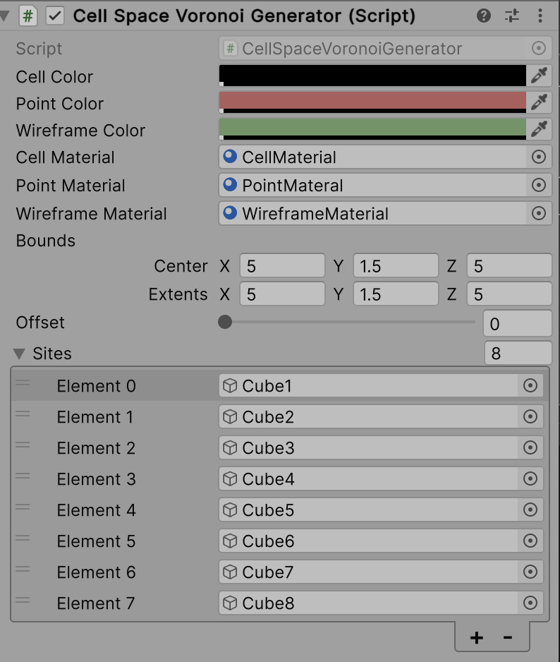
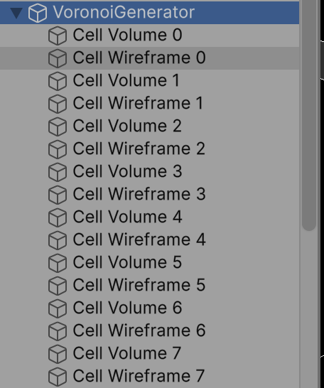
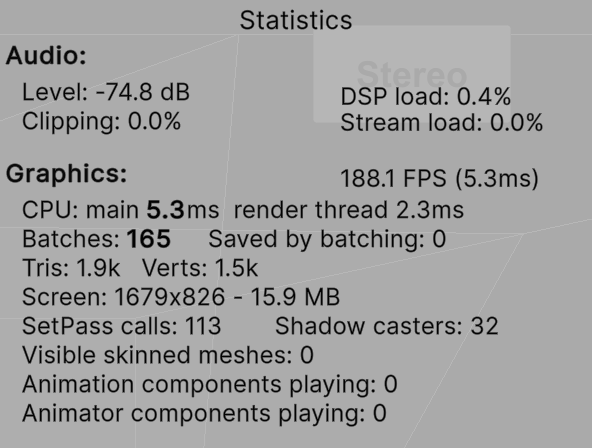
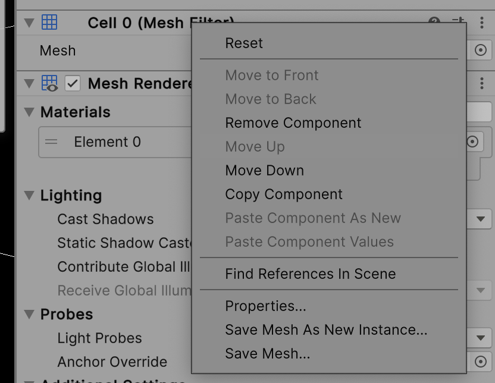

# VoroGen 

VoroGen is an Voronoi Generator for Cell Space. 

## System Requirements

* Unity 2023.2
* macOS 14 (Apple Silicon and Intel)
* iOS 17

## Voronoi Generation 


### Inputs 



#### Sites
Each site for Voronoi 3D diagram (Power Diagram) is defined by (x, y, z, w). 

Assign all the objects in `Sites` of `VoronoiGenerator`. 
The transform of the object is the location of Voronoi site.
The size of the object is the weight of Voronoi site.


#### Bounds 

The bounding box is defined by `Bounds` of `VoronoiGenerator`.

#### Offset

`Offset` is the distance ratio between cells. 

### Output

For each cell, VoroGen generates 

- a volumatric mesh with triangle as primitive
- a wireframe mesh as line as primitive. 



### Efficiency 

It runs 200 fps on M1 Max Mac. 



## How to save mesh

- Right click on a MeshFilter component's label or click on its gear icon to open up its context menu.
- Then select either "Save Mesh..." or "Save Mesh As New Instance...".
- Save Mesh... will save the current shared mesh as an asset file.
- Save Mesh As New Instance... will save a copy of the current mesh.

- Note that "Save Mesh..." will not work if the mesh comes from an imported 3D asset/prefab.




## Some Mathematica prototypes

We use Mathematica to simulate the cell space.
```Mathematica
n = 12; nframe = 200; width = 30; height = 5; length = 30; margin = 6; 
averageheightofuser = 1.6; steplengthofuser = 0; heightmovementofuser \
= 0.3; pts = 
 Join[Join[RandomReal[{0 + margin, length - margin}, {n, 1}], 
   RandomReal[{0 + margin, width - margin}, {n, 1}], 2], 
  RandomReal[{averageheightofuser - 0.1, 
    averageheightofuser + 0.1}, {n, 1}], 2];
deltapaths = 
  Transpose[
   Function[deltastep, 
     Join[Accumulate[
       RandomReal[{-steplengthofuser - deltastep, 
         steplengthofuser + deltastep}, {nframe, 2}]], 
      Accumulate[
       RandomReal[{-heightmovementofuser, 
         heightmovementofuser}, {nframe, 1}]], 2]] /@ {0.2, 0.2, 0.2, 
     0.2, 0.2, 0.2, 0.2, 0.2, 0.2, 0.00, 0.00, 0.00}];
pathpts = Function[deltapt, pts + deltapt] /@ deltapaths;
frames = 
  Function[pts, 
    voronoi = 
     VoronoiMesh[pts, {{0, length}, {0, width}, {0, height}},
      MeshCellStyle -> {{1, All} -> Black, {2, All} -> 
         Opacity[0.2, White]}, MeshCellLabel -> {}, 
      PlotTheme -> "Lines"]; 
    delaunay = 
     DelaunayMesh[pts, 
      MeshCellStyle -> {{1, All} -> Red, {2} -> Opacity[0]}];
    Show[voronoi, delaunay, 
     Graphics3D[{Blue, PointSize[Large], Point[pts]}]]] /@ pathpts;

ListAnimate[frames, 60]
```


